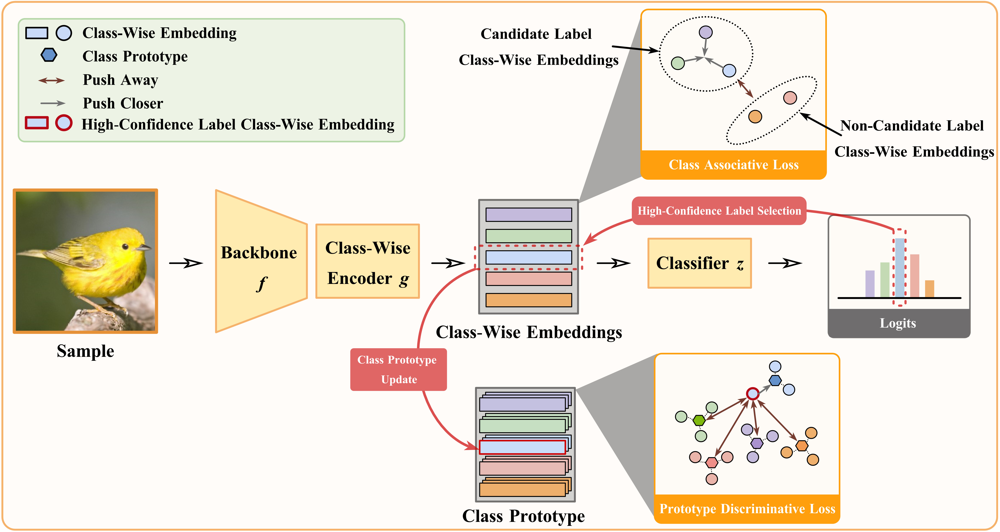

@inproceedings{NLR, author = {Fuchao Yang and Jianhong Cheng and Yuheng Jia and Hui Liu and Yongqiang Dong and Junhui Hou}, title = {Mixed Blessing: Class-Wise Embedding guided
Instance-Dependent Partial Label Learning}, booktitle = {{KDD}}, publisher = {{ACM}}, year = {2025} }

**Run CIFAR-100**

```
python -u main.py --ds cifar100 --lr 5e-2 --wd 1e-4 --alpha 0.5 --gamma1 1 --beta 1 --gamma2 1
```

**Run CIFAR-100H**

```
python -u main.py --ds cifar100H --lr 5e-2 --wd 1e-4 --alpha 0.1 --gamma1 2 --beta 1 --gamma2 1
```

**Run FGVC100**

```
python -u main.py --ds fgvc100 --lr 5e-2 --wd 5e-4 --alpha 0.1 --gamma1 1 --beta 0.5 --gamma2 5
```

**Run DOGS120**

```
python -u main.py --ds dogs120 --lr 1e-3 --wd 1e-4 --alpha 0.1 --gamma1 2 --beta 1 --gamma2 0.5
```

**Run CARS196**

```
python -u main.py --ds cars196 --lr 5e-2 --wd 1e-4 --alpha 0.5 --gamma1 1 --beta 1 --gamma2 2
```

**Run CUB200**

```
python -u main.py --ds cub200 --lr 1e-2 --wd 1e-4 --alpha 0.5 --gamma1 1 --beta 1 --gamma2 1
```
